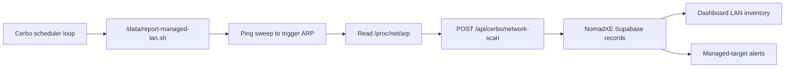

# Cerbo GX Batch LAN Scan Deployment

This runbook explains how to deploy the NomadXE Cerbo LAN scanner to one or many Cerbo GX devices using SSH/SCP from a workstation.

Use this method when your workstation can reach each Cerbo's SSH service through Teltonika RMS, a VPN, or a port-forwarded endpoint.

If you can only open Victron Remote Console or Node-RED in a browser and cannot run `ssh` or `scp` from your workstation, use the Node-RED runbook instead: [cerbo-node-red-lan-scan.md](./cerbo-node-red-lan-scan.md).

## What The Batch Method Installs

The batch deploy script copies and configures these files on each Cerbo:

```txt
/data/report-managed-lan.sh
/data/conf/managed-network-monitor.conf
/data/managed-network-monitor-loop.sh
/data/rc.local
```

The flow after deployment is:



The scanner reports a host as online when either:

- `ping` succeeds, or
- `ping` does not succeed but the Cerbo has a complete ARP entry for that IP.

This matters because many cameras, NVRs, switches, and embedded devices block ICMP but still answer ARP on the same local network.

## Verified Platform Facts

- Victron documents SSH access for Venus OS through the `root` user after SSH on LAN is enabled.
- Victron documents `/data` as the persistent partition and `/data/rc.local` as a supported boot hook for custom code.
- Victron documents Remote Console through local LAN and VRM, but Remote Console is not the same thing as an SSH/SCP endpoint.
- Teltonika RMS Remote Access supports direct access to LAN-connected third-party devices using protocols including SSH and SFTP.
- Teltonika RMS LAN device access requires the destination device IP and destination port.

Sources:

- [Victron Venus OS root access](https://www.victronenergy.com/live/ccgx%3Aroot_access)
- [Victron Cerbo GX access methods](https://www.victronenergy.com/media/pg/Cerbo-S_GX/en/accessing-the-gx-device.html)
- [Teltonika RMS Remote Access](https://wiki.teltonika-networks.com/view/RMS_Remote_Access)
- [Teltonika LAN device access in RMS](https://wiki.teltonika-networks.com/view/How_to_configure_remote_access_to_LAN_devices_in_RMS%3F)

## Critical Rule: Batch Requires Reachable SSH

The script does not magically reach private LAN addresses across the internet.

This works:

```powershell
ssh -p 22 root@192.168.1.246
```

only when your workstation is on that trailer LAN or connected to a VPN/remote-access path that routes to that exact trailer LAN.

This does not work from a random outside network:

```powershell
ssh root@192.168.1.246
```

when `192.168.1.246` is only the Cerbo's private address behind the Teltonika router.

If every trailer uses:

```txt
Cerbo LAN IP: 192.168.1.246
Gateway:      192.168.1.1
Subnet:       192.168.1.0/24
```

that is okay locally, but your batch CSV still needs a unique reachable SSH endpoint per trailer. The `Host` column must be the reachable endpoint from your workstation, not just a repeated private IP, unless you are connected to exactly one trailer network at a time.

## Remote SSH Access Options

### Option A: Teltonika RMS Remote Access

Use this when the Teltonika router is enrolled in RMS and you want Teltonika to broker access to the Cerbo.

In RMS:

1. Open `RMS Connect`.
2. Open `Remote access`.
3. Add a new connection.
4. Choose the Teltonika router for that trailer.
5. Enter the Cerbo LAN IP, for example `192.168.1.246`.
6. Enter destination port `22`.
7. Select protocol `SSH`.
8. Save the connection.
9. Generate or open the SSH access connection.

For the batch script, you need an SSH endpoint that your local terminal can use with `ssh` and `scp`. If RMS only gives you an in-browser SSH session and no local host/port endpoint usable by OpenSSH, the batch script cannot use that browser session directly.

Use RMS batch deployment only when you can turn the RMS connection into values like:

```csv
Host,SshPort,SshUser
rms-generated-host.example,12345,root
```

or equivalent values that work from PowerShell:

```powershell
ssh -p 12345 root@rms-generated-host.example
scp -P 12345 .\some-file root@rms-generated-host.example:/data/
```

### Option B: Teltonika VPN

Use this when your workstation joins a VPN that can route to the trailer LAN.

This is the cleanest batch path if the VPN design gives each trailer a unique routed subnet or unique NAT mapping.

Important: if every trailer uses `192.168.1.0/24`, your workstation cannot route to all of them at the same time without site-specific NAT, policy routing, or one-VPN-at-a-time operation. With overlapping private subnets, either connect to one trailer at a time or give each trailer a unique mapped SSH endpoint.

### Option C: Port Forwarding Or DDNS

Use this only when you intentionally expose a unique external port on the Teltonika router to the Cerbo's port `22`.

Example mapping:

```txt
trailer-001.example.net:22001 -> 192.168.1.246:22
trailer-002.example.net:22002 -> 192.168.1.246:22
```

Security requirements:

- Prefer SSH keys over passwords.
- Restrict source IPs if possible.
- Do not expose port `22` broadly to the public internet without firewall controls.
- Disable the forwarding when not needed if this is only a rollout path.

### Option D: Victron Remote Console

Remote Console is useful to enable SSH and inspect settings. It is not an SSH/SCP transport for this batch script.

Use Remote Console to:

1. Confirm the Cerbo is online.
2. Enable SSH on LAN.
3. Confirm the Cerbo LAN IP.
4. Open Node-RED if you are using the browser-based fallback method.

Do not expect this command to work merely because Remote Console works:

```powershell
ssh root@192.168.1.246
```

Your workstation still needs a route or a remote-access endpoint to that Cerbo.

## Prerequisites

Website:

- The NomadXE deployment is live.
- `CERBO_INGEST_TOKEN` is set in Vercel.
- The Supabase migrations for managed/discovered network devices are applied.
- Each trailer exists in `vrm_devices` with the correct `vrm_site_id`.
- Optional: `MAKE_NETWORK_ALERT_WEBHOOK_URL` is set if managed-device alerts should go to Make.

Workstation:

- Windows PowerShell.
- OpenSSH `ssh` available.
- OpenSSH `scp` available.
- A copy of this repository.
- Network path to each Cerbo's SSH endpoint.

Cerbo:

- SSH on LAN enabled.
- Root password or SSH key available.
- Cerbo is on the same Teltonika LAN as the devices it should observe.
- Cerbo has outbound HTTPS access to `https://www.nomadxe.com`.
- `/data` partition is writable.

## Step 1: Confirm Website Token Exists

In Vercel, set:

```txt
CERBO_INGEST_TOKEN=<long-random-secret>
```

Use a long random value. Do not reuse a password.

The currently implemented backend accepts one shared fleet token. The batch CSV also supports a per-row `Token` column so the deployment path is ready for a future per-Cerbo token model.

## Step 2: Confirm Each Cerbo Has SSH Enabled

From Victron Remote Console:

1. Open the target Cerbo.
2. Go to `Settings`.
3. Go to `General`.
4. Enable `SSH on LAN`.
5. Set or confirm root access according to Victron's root access process.
6. Record the Cerbo LAN IP, usually `192.168.1.246` in this fleet.

If you cannot find SSH settings, confirm the access level is high enough for advanced settings.

## Step 3: Prove SSH Reachability Before Batch

From your workstation, test the endpoint that will go into the CSV.

For a normal LAN/VPN endpoint:

```powershell
Test-NetConnection 192.168.1.246 -Port 22
ssh root@192.168.1.246 "uname -a && ip -4 addr && ip -4 route"
```

For a custom remote endpoint:

```powershell
Test-NetConnection trailer-001.example.net -Port 22001
ssh -p 22001 root@trailer-001.example.net "uname -a && ip -4 addr && ip -4 route"
```

Expected result:

- TCP test succeeds.
- SSH prompts for the Cerbo password or uses your key.
- The command prints Linux/Venus OS information.
- `ip -4 route` shows the local trailer LAN and default route through the Teltonika router.

Do not proceed to batch until this works for at least one Cerbo.

## Step 4: Build The CSV

Create a working CSV from:

```txt
scripts/cerbo-gx/cerbos.example.csv
```

Recommended working file:

```txt
scripts/cerbo-gx/cerbos.production.csv
```

Columns:

```csv
Host,SiteId,SshPort,SshUser,ScanCidr,ScanMode,Token
```

Column meanings:

- `Host`: the reachable SSH host/IP from your workstation.
- `SiteId`: the VRM site ID shown in NomadXE for that trailer.
- `SshPort`: SSH port, usually `22`, or a mapped external port.
- `SshUser`: usually `root`.
- `ScanCidr`: trailer LAN to scan, normally `192.168.1.0/24`.
- `ScanMode`: use `auto` for full LAN inventory.
- `Token`: optional override; leave blank to use `$env:CERBO_INGEST_TOKEN`.

Example for one VPN-connected trailer:

```csv
Host,SiteId,SshPort,SshUser,ScanCidr,ScanMode,Token
192.168.1.246,799263,22,root,192.168.1.0/24,auto,
```

Example for multiple forwarded endpoints:

```csv
Host,SiteId,SshPort,SshUser,ScanCidr,ScanMode,Token
trailer-001.example.net,799263,22001,root,192.168.1.0/24,auto,
trailer-002.example.net,810801,22002,root,192.168.1.0/24,auto,
trailer-003.example.net,811345,22003,root,192.168.1.0/24,auto,
```

Do not put the same `192.168.1.246` host in multiple rows unless your workstation is connected to one trailer network at a time and you run one row at a time.

## Step 5: Dry Run

Set the token in your current PowerShell session:

```powershell
$env:CERBO_INGEST_TOKEN = "paste-the-same-token-configured-in-vercel"
```

Run a dry run:

```powershell
powershell.exe -NoProfile -ExecutionPolicy Bypass -File .\scripts\cerbo-gx\deploy-lan-monitor.ps1 -CsvPath .\scripts\cerbo-gx\cerbos.production.csv -WhatIf
```

Expected summary:

```txt
Status  Detail
Preview WhatIf only; no changes made
```

This validates CSV parsing and command availability. It does not connect to Cerbos.

## Step 6: Deploy One Cerbo First

For the first trailer, use a CSV with one row only.

Deploy and run an immediate test scan:

```powershell
powershell.exe -NoProfile -ExecutionPolicy Bypass -File .\scripts\cerbo-gx\deploy-lan-monitor.ps1 -CsvPath .\scripts\cerbo-gx\cerbos.production.csv -RunTest
```

Default behavior:

- Copies the reporter to `/data/report-managed-lan.sh`.
- Copies config to `/data/conf/managed-network-monitor.conf`.
- Installs `/data/managed-network-monitor-loop.sh`.
- Adds an idempotent NomadXE block to `/data/rc.local`.
- Runs one immediate test scan when `-RunTest` is used.
- Starts the background scanner immediately after the test scan succeeds.
- Schedules future scans every `900` seconds.

To change the interval:

```powershell
powershell.exe -NoProfile -ExecutionPolicy Bypass -File .\scripts\cerbo-gx\deploy-lan-monitor.ps1 -CsvPath .\scripts\cerbo-gx\cerbos.production.csv -RunTest -IntervalSeconds 1800
```

To deploy files without installing the recurring schedule:

```powershell
powershell.exe -NoProfile -ExecutionPolicy Bypass -File .\scripts\cerbo-gx\deploy-lan-monitor.ps1 -CsvPath .\scripts\cerbo-gx\cerbos.production.csv -RunTest -NoSchedule
```

## Step 7: Verify On The Cerbo

Check the installed files:

```powershell
ssh root@192.168.1.246 "ls -l /data/report-managed-lan.sh /data/conf/managed-network-monitor.conf /data/managed-network-monitor-loop.sh /data/rc.local"
```

Check the config without printing the token:

```powershell
ssh root@192.168.1.246 "sed 's/^CERBO_INGEST_TOKEN=.*/CERBO_INGEST_TOKEN=<redacted>/' /data/conf/managed-network-monitor.conf"
```

Check the scheduler loop:

```powershell
ssh root@192.168.1.246 "ps | grep managed-network-monitor | grep -v grep || true"
```

Check the scan log:

```powershell
ssh root@192.168.1.246 "tail -n 80 /tmp/managed-network-monitor.log"
```

Run a manual scan:

```powershell
ssh root@192.168.1.246 "/data/report-managed-lan.sh"
```

Expected successful response:

```json
{
  "ok": true,
  "vrmSiteId": "799263",
  "discovered": 4,
  "updated": 0,
  "markedOffline": 0,
  "scanMode": "full",
  "ignored": []
}
```

Use `-p <port>` in every `ssh` command when your endpoint uses a nonstandard port.

## Step 8: Verify In NomadXE

1. Open the NomadXE dashboard.
2. Click the trailer tile for the same `SiteId`.
3. Open `LAN Device Inventory`.
4. Confirm discovered devices appear automatically.
5. Open the admin page.
6. Promote only critical devices into managed targets if they should trigger alerts.

The dashboard detail panel refreshes while open. If a scan succeeds but the UI is already open, wait up to one refresh interval or reload the page.

## Step 9: Roll Out In Batches

Recommended rollout order:

1. One known trailer.
2. Five trailers.
3. Ten to twenty trailers.
4. Remaining fleet.

After each batch:

- Confirm the PowerShell summary has no `Failed` rows.
- Spot-check `/tmp/managed-network-monitor.log` on one Cerbo.
- Check the dashboard for newly discovered LAN inventory.
- Check Vercel logs for `/api/cerbo/network-scan` errors.

## Troubleshooting

### SSH Times Out

Cause:

- Your workstation has no route to that Cerbo SSH endpoint.
- RMS/VPN/port forwarding is not active.
- The host value is the private Cerbo LAN IP but you are not on that LAN.

Fix:

```powershell
Test-NetConnection <Host> -Port <SshPort>
```

Then fix RMS/VPN/port-forward routing before running the batch script.

### Password Works In Browser RMS But Batch Fails

Cause:

- Browser-based RMS SSH is not the same as a local OpenSSH endpoint.

Fix:

- Create a remote access mode that exposes a host/port usable by `ssh` and `scp`, or use the Node-RED manual method.

### `401 Unauthorized`

Cause:

- Cerbo token does not match Vercel `CERBO_INGEST_TOKEN`.
- Vercel environment variable was not redeployed after adding the token.

Fix:

1. Confirm `CERBO_INGEST_TOKEN` in Vercel production.
2. Redeploy production if needed.
3. Rerun the batch deploy with the correct token.

### `404 Unknown vrmSiteId`

Cause:

- CSV `SiteId` does not match a registered NomadXE `vrm_devices.vrm_site_id`.

Fix:

- Correct the CSV row to the site ID shown in the dashboard/admin fleet source.

### Discovered Count Is Zero

Cause:

- Cerbo is not on the same LAN/broadcast domain as the devices.
- `ScanCidr` is wrong.
- Devices are on another VLAN.
- Devices are silent and do not answer ARP during the scan.

Fix:

On the Cerbo:

```sh
ip -4 addr
ip -4 route
cat /proc/net/arp
/data/report-managed-lan.sh
```

Confirm the scanner is using the same subnet as the cameras/NVR/router-side devices.

### Everything Looks Offline After A Full Scan

Cause:

- `SCAN_MODE=auto` posts `scanMode: full`.
- The backend marks previously observed missing hosts offline after a full scan.
- This is intentional so stale inventory does not stay falsely online.

Fix:

- Confirm the Cerbo can actually observe the LAN.
- Increase interval if the LAN is slow.
- Use `SCAN_MODE=targets` only when you want to monitor a curated target list instead of inventory discovery.

### The Loop Is Not Running After Reboot

Cause:

- `/data/rc.local` was disabled by Venus OS modification checks.
- The install did not complete.

Fix:

1. In Remote Console, check `Settings -> General -> Modification checks`.
2. Confirm modifications are enabled.
3. Re-run the batch deploy.
4. Check `/data/rc.local` contains the `NOMADXE MANAGED NETWORK MONITOR` block.

## Rollback

Stop the loop:

```powershell
ssh root@192.168.1.246 'pid=$(cat /var/run/managed-network-monitor-loop.pid 2>/dev/null || true); [ -n "$pid" ] && kill "$pid" 2>/dev/null || true'
```

Remove the NomadXE boot block:

```powershell
ssh root@192.168.1.246 "sed '/# BEGIN NOMADXE MANAGED NETWORK MONITOR/,/# END NOMADXE MANAGED NETWORK MONITOR/d' /data/rc.local > /data/rc.local.tmp && mv /data/rc.local.tmp /data/rc.local && chmod +x /data/rc.local"
```

Remove installed files:

```powershell
ssh root@192.168.1.246 "rm -f /data/report-managed-lan.sh /data/managed-network-monitor-loop.sh /data/conf/managed-network-monitor.conf"
```

Use `-p <port>` for mapped endpoints.

## Security Notes

- Treat `CERBO_INGEST_TOKEN` as a production secret.
- Do not paste full config files into tickets or chat because they contain the token.
- Prefer SSH keys over shared passwords.
- If port forwarding is used, restrict by source IP and use non-default external ports.
- Review RMS access history after rollout.
- Keep the scanner interval reasonable. The default `900` seconds avoids unnecessary load.

## Operator Checklist

Before rollout:

- `CERBO_INGEST_TOKEN` exists in Vercel production.
- First Cerbo SSH endpoint works from PowerShell.
- CSV has the correct `Host`, `SshPort`, and `SiteId`.
- One-Cerbo `-RunTest` succeeds.
- Dashboard shows discovered LAN devices.

After rollout:

- Batch summary has no failed rows.
- At least one Cerbo log shows successful scans.
- Dashboard inventory appears under trailer tiles.
- Alerts are enabled only for promoted managed devices.
